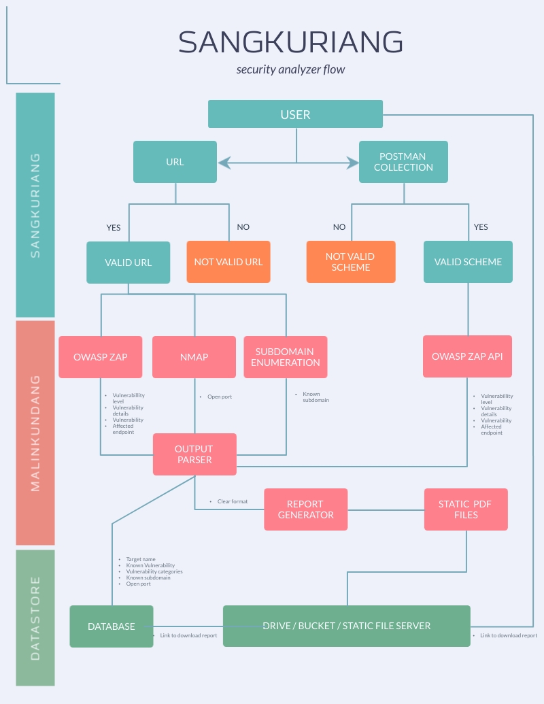

# Malinkundang

> STILL IN DEVELOPMENT

Malinkundang is Backend for Sangkuriang Project, A security analyzer tools
You find the Frontend in https://github.com/Proyek-Sangkuriang/sangkuriang

# Project flow


## Features

+ Python FastAPI backend.
+ MongoDB database.
+ Authentication.
+ OWASP ZAP
    + Spider mode
+ NMAP
    + Top 200 open ports

## How To Use

### Dependencies

Please install all folowing dependencies to run all the feature in malinkundang

- NMAP      - https://nmap.org/download.html
- MongoDB   - https://github.com/Proyek-Sangkuriang/purbasari/tree/master/mongo-db
- OWASP ZAP - https://github.com/Proyek-Sangkuriang/purbasari/tree/master/owasp-zap

### Run

Clone this repository and make a virtual environment in it. Install the modules listed in the `requirements.txt` file:

```console
pip3 install -r requirements.txt
```

To run the starter:

First, set your `PYTHONPATH`:

```console
export PYTHONPATH=$PWD
```

Next:

```console
python3 app/main.py
```

The starter listens on port 8000 on address [0.0.0.0](0.0.0.0).

Please refer to http://localhost:8000/docs to check all API route and test it.

### Avilable scanner
#### NMAP
http://localhost:8000/nmap/scan/{target}/

#### OWASP ZAP
http://localhost:8000/zap/{target}/spider

## Contributing ?

Fork the repo, make changes and send a PR. We'll review it together!

## TODOS

- [ ] Add a simple bash script file that runs the installation process.

- [ ] Fix Authentication logic

- [ ] Add Dockerfile

- [ ] Deploying to Heroku

- [ ] Write a concise README

- [ ] Add OWASP ZAP module for normal mode

- [ ] Add Subdomain enumeration module

# List tested environment

tested by [@arkwrn](https://github.com/arkwrn) :
- OS       : MacOS Catalina 10.15.7
- Database : https://github.com/Proyek-Sangkuriang/purbasari/tree/master/mongodb
- Python   : 3.7.2

## License

This project is licensed under the terms of MIT license.

# Contact Us

Email : hubungi.aja@gmail.com
