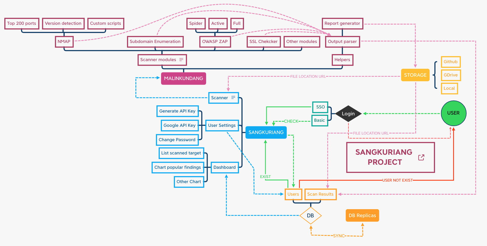

# Malinkundang

Malinkundang is Backend for Sangkuriang Project, A security analyzer tools
You find the Frontend in https://github.com/Proyek-Sangkuriang/sangkuriang (STILL IN DEVELOPMENT)

# Project flow


## Features

+ Python FastAPI backend.
+ MongoDB database.
+ JWT Authentication
+ OWASP ZAP
    + Spider mode
+ NMAP
    + Top 200 open ports
+ Chaos
    + Enumerate subdomains

## How To Use

### Dependencies

Please install all folowing dependencies to run all the feature in malinkundang

- NMAP      - https://nmap.org/download.html
- MongoDB   - https://github.com/Proyek-Sangkuriang/purbasari/tree/master/mongo-db
- OWASP ZAP - https://github.com/Proyek-Sangkuriang/purbasari/tree/master/owasp-zap

### Run

Clone this repository and make a virtual environment in it. Install the modules listed in the `requirements.txt` file:

```console
pip3 install -r requirements.txt
```

To run the starter:

First, set your `PYTHONPATH`:

```console
export PYTHONPATH=$PWD
```

Next, Put the output of this comman into `.env` file with variable name `SECRET`

```console
openssl rand -hex 32
```
Run the app :

```console
python3 run.py
```

The starter listens on port 1337 on address [localhost:1337](0.0.0.0:1337).

Please refer to http://localhost:1337/docs to check all API route and test it.

### Sample Database

Create Database with name `Sangkuriang` in your MongoDB and import sample collection thet you can find in `database/admins.json`

Default credentials for login in `/admin/login/`:

  "username": "admin@sangkuriang.local"
  "password": "#Sangkuriang-2k21!"

### Avilable scanner

#### NMAP
http://localhost:8000/scan/nmap/{target}/top-port

#### OWASP ZAP
http://localhost:8000/scan/zap/{target}/spider

#### CHAOS
http://localhost:8000/scan/subdomains/{target}

## Deploying to Heroku

To deploy to Heroku, connect your repository to the Heroku application and deploy the branch master.

Ensure you add the environment variable `MONGO_DETAILS` in your application's settings.

## Dockerising

To build a docker image for this boilerplate, create a duplicate `.env` file but with name `env`. Next, build an image:

```console
docker build -t sangkuriang-backend .
```

The command above builds an image that can be deployed. To run the image in a container:

```console
docker run --env-file env -d --name sangkuriang-backend -p 1337:1337 sangkuriang-backend:latest
```

## Contributing ?

Fork the repo, make changes and send a PR. We'll review it together!

#### Module contribute notes

Please put your module in the `server/modules` directory then make sure the module only accepts 2 input, which is `target` and `supporting arguments`, the module output should be in `JSON Format` which will then be parsed by the output parser to match the report to be generated.

Please put your new module in `server/routes/scan.py` with following format `/<MODULE_NAME>/{target}/<MODULE_OPTIONS>`, see existing modules route for example.

## To Do's

- [ ] Add a simple bash script file that runs the installation process.

- [ ] Multiple Authentication

- [X] Add Dockerfile

- [X] Deploying to Heroku

- [ ] Write a concise README

- [ ] Add OWASP ZAP module for normal mode

- [X] Add Subdomain enumeration module

# List tested environment

tested by [@arkwrn](https://github.com/arkwrn) :
- OS       : MacOS Catalina 10.15.7
- Database : https://github.com/Proyek-Sangkuriang/purbasari/tree/master/mongodb
- Python   : 3.7.2

## License

This project is licensed under the terms of MIT license.

# Contact Us

Email : hubungi.aja@gmail.com

# Thanks to

[@Youngestdev](https://github.com/Youngestdev/fastapi-mongo) : Providing FastAPI template
